# SustainIQ 🍃
**Enterprise Decision Intelligence for Sustainable Procurement**

 <!-- Note: Add a real screenshot here later -->

SustainIQ is a **Multi-Agent Decision Intelligence Platform** designed to solve a complex enterprise challenge: *evaluating and shifting supply chains based on cost, delivery, risk, and sustainability tradeoffs.* 

Instead of just returning search results, SustainIQ operates as a true **Procurement Analyst**, executing deep web discovery, crunching quantitative risk metrics, and mathematically scoring candidate suppliers through a unified decision matrix.

## 🚀 The Business Problem
Modern procurement teams spend weeks manually evaluating vendors. They are forced to balance strict budgets and lead times against opaque sustainability claims and geopolitical risks. 

**SustainIQ automates this entire pipeline:**
1. **Agentic Discovery**: Finds exact manufacturers and suppliers (avoiding generic marketplaces) based on natural language queries.
2. **Contextual Evaluation**: Validates supplier claims against Model Context Protocol (MCP) risk databases and live sustainability metrics (e.g., ISO 14001, recycled material usage).
3. **Mathematical Decision Engine**: Computes unit economics, penalizes geographic constraints, and generates an overall weighted `decision_score`.
4. **Transparent Reporting**: Outputs a highly structured, boardroom-ready Procurement Analyst Report comparing the top candidates side-by-side.

## 🧠 Architecture & Tech Stack

SustainIQ is built on a modern, robust, and heavily typed full-stack architecture powered by the latest advancements in LLM orchestration.

- **Frontend**: React, Vite, TypeScript, Tailwind CSS, Lucide Icons.
- **Backend**: FastAPI, Python 3.11, SQLAlchemy (PostgreSQL + pgvector).
- **Agentic Engine**: Strands SDK (ReAct Loop), AWS Bedrock (`amazon.nova-lite-v1:0`).
- **Data Integration**: Model Context Protocol (MCP) for deterministic database lookups.
- **Infrastructure**: Fully containerized via Docker Compose.

```mermaid
graph TD;
    User([User Query]) --> Frontend[React / Vite UI];
    Frontend <-->|REST API| API[FastAPI Backend];
    API <--> DB[(PostgreSQL + SQLAlchemy)];
    
    API --> Orchestrator[Decision Agent<br>AWS Bedrock Nova Lite];
    
    Orchestrator -->|Tool Call| Discovery[Discovery Agent<br>Deep Web Search];
    Orchestrator -->|Tool Call| Evaluation[Evaluation Agent<br>MCP Risk & ESG Databases];
    
    Discovery -.-> Orchestrator;
    Evaluation -.-> Orchestrator;
    
    Orchestrator -->|Final Decision Matrix| API;
```



## 🤖 Agentic & MCP Architecture

SustainIQ moves beyond basic LLM wrappers by implementing a deterministic **Model Context Protocol (MCP)** layer and a specialized Multi-Agent hierarchy using the **Strands SDK**.

### The Agent Hierarchy
1. **Decision Agent (The Orchestrator)**: Acts as the lead Procurement Analyst. It parses natural language constraints, orchestrates sub-agents, mathematically computes the final decision scores, and formats the comparative matrix.
2. **Discovery Agent**: Handles deep web research using the Tavily API. It dynamically searches for true manufacturers, extracts sustainability PDFs, and validates material sourcing claims.
3. **Evaluation Agent**: Interfaces directly with the enterprise database layer to assess historical compliance, geopolitical risks, and existing ESG certifications.

### Model Context Protocol (MCP) Integration
To prevent LLM hallucination and ensure deterministic data retrieval, SustainIQ integrates four distinct MCP servers. The Evaluation Agent queries these servers as discrete tools:

## MCP Services

### Supplier MCP
- Supplier discovery
- Supplier comparison
- Profile retrieval

### Risk MCP
- Supplier risk
- Concentration risk

### Sustainability MCP
- Sustainability scoring
- Emissions proxy analysis

### Procurement MCP
- Spend analysis
- Cost evaluation

## ✨ Key Features

- **The Supplier Comparison Matrix**: A mathematically rigorous breakdown of Cost, Delivery, Risk, Sustainability, and Location scores for at least 3 candidate suppliers per query.
- **Geographic Constraint Engine**: Strictly enforces and penalizes suppliers outside of user-defined geographic bounds.
- **Verifiable Sustainability**: All ESG claims are cross-referenced and backed by explicitly generated evidence URLs.
- **Full Transparency Trace**: A built-in UI panel exposes the inner "thoughts" and tool calls of the ReAct multi-agent loop, proving how the engine arrived at its decision.
- **End-to-End Persistence**: Every query, matrix, and reasoning trace is securely persisted in PostgreSQL, enabling historical audits and one-click "Approve / Reject" workflows.

## 🛠️ Local Development Setup

To run SustainIQ locally, you need Docker Desktop and an AWS account with Bedrock access.

1. **Clone the repository:**
   ```bash
   git clone https://github.com/ja616/SustainOps.git
   cd SustainOps
   ```

2. **Configure Environment Variables:**
   Create a `.env` file in the root directory:
   ```env
   # Database
   POSTGRES_USER=sustainiq
   POSTGRES_PASSWORD=your_password
   POSTGRES_DB=sustainiq_db
   
   # AWS Bedrock Credentials
   AWS_ACCESS_KEY_ID=your_access_key
   AWS_SECRET_ACCESS_KEY=your_secret_key
   AWS_DEFAULT_REGION=us-east-1
   
   # API Keys
   TAVILY_API_KEY=your_tavily_api_key
   ```

3. **Launch the Cluster:**
   ```bash
   docker compose up --build
   ```

4. **Access the Application:**
   - Frontend UI: `http://localhost:5173`
   - FastAPI Swagger Docs: `http://localhost:8000/docs`

---
*Built with passion to demonstrate the power of Agentic AI in complex enterprise workflows.*
